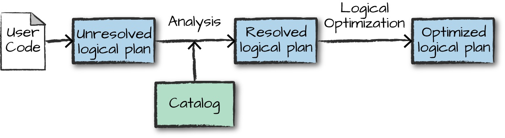

## Structured API

- The Structured APIs are a tool for manipulating all sorts of data, from unstructured log files to semi-structured CSV files and highly
  structured Parquet files.
- These APIs refer to three core types of distributed collection APIs:
    - Datasets
    - DataFrames
    - SQL tables and views
- The Structured APIs are the fundamental abstraction that you will use to write the majority of your data flows.
- the majority of the Structured APIs apply to both batch and streaming computation.
___
&nbsp;

### basics
- Spark is a distributed programming model in which the user specifies transformations.
- Multiple transformations build up a directed acyclic graph of instructions.
- An action begins the process of executing that graph of instructions, as a single job, by breaking it down into stages and tasks to execute across the         cluster.
- The logical structures that we manipulate with transformations and actions are DataFrames and Datasets.
- To create a new DataFrame or Dataset, you call a transformation.
- To start computation or convert to native language types, you call an action.
___

&nbsp;

### DataFrames and Datasets
- Spark has two notions of structured collections
    - DataFrames
    - Datasets
- DataFrames and Datasets are (distributed) table-like collections with well-defined rows and columns.
- To Spark, DataFrames and Datasets represent immutable, lazily evaluated plans that specify what operations to apply to data residing at a location to          generate some output.
- When we perform an action on a DataFrame, we instruct Spark to perform the actual transformations and return the result.
- These represent plans of how to manipulate rows and columns to compute the user’s desired result.
- Tables and views are basically the same thing as DataFrames. We just execute SQL against them instead of DataFrame code.

### Schemas
- A schema defines the column names and types of a DataFrame.
- You can define schemas manually or read a schema from a data source (often called schema on read).

### Overview of Structured Spark Types
- Spark is effectively a programming language of its own.
- Internally, Spark uses an engine called Catalyst that maintains its own type information through the planning and processing of work.
- In doing so, this opens up a wide variety of execution optimizations that make significant differences.
- Spark types map directly to the different language APIs that Spark maintains and there exists a lookup table for each of these 
  in Scala, Java, Python, SQL, and R.
- Even if we use Spark’s Structured APIs from Python or R, the majority of our manipulations will operate strictly on Spark types,      not Python types.

### DataFrames Versus Datasets
- In essence, within the Structured APIs, there are two more APIs, the “untyped” DataFrames and the “typed” Datasets.
- To say that DataFrames are untyped is aslightly inaccurate; they have types, but Spark maintains them completely and only checks     whether those types line up to those specified in the schema at runtime.
- Datasets, on the other hand, check whether types conform to the specification at compile time.
- Datasets are only available to Java Virtual Machine (JVM)–based languages (Scala and Java) and we specify types with case classes or Java beans.
- To Spark (in Scala), DataFrames are simply Datasets of Type Row.
- The “Row” type is Spark’s internal representation of its optimized in-memory format for computation.
- This format makes for highly specialized and efficient computation because rather than using JVM types, which can cause high garbage-collection and object instantiation costs, Spark can operate on its own internal format without incurring any of those costs.
- To Spark (in Python or R), there is no such thing as a Dataset: everything is a DataFrame and therefore we always operate on that optimized format.

### Columns
- Columns represent a simple type like an integer or string, a complex type like an array or map, or a null value.

### Rows
- A row is nothing more than a record of data.
- Each record in a DataFrame must be of type Row.

&nbsp;

### Overview of Structured API Execution
- Here’s an overview of the steps:
    1. Write DataFrame/Dataset/SQL Code.
    2. If valid code, Spark converts this to a Logical Plan.
    3. Spark transforms this Logical Plan to a Physical Plan, checking for optimizations along the way.
    4. Spark then executes this Physical Plan (RDD manipulations) on the cluster.
- To execute code, we must write code. This code is then submitted to Spark      either through the console or via a submitted job.
- This code then passes through the Catalyst Optimizer, which decides how the
code should be executed and lays out a plan for doing so before, finally, the code is run and the result is returned to the user.

### Logical Planning
- The first phase of execution is meant to take user code and convert it into a logical plan.
- This logical plan only represents a set of abstract transformations that do not refer to executors or
drivers, it’s purely to convert the user’s set of expressions into the most optimized version.
- It does this by converting user code into an unresolved logical plan.
- This plan is unresolved because although your code might be valid, the tables or columns that it refers to might or might not exist.
- Spark uses the catalog, a repository of all table and DataFrame information, to resolve columns and tables in the analyzer.
- The analyzer might reject the unresolved logical plan if the required table or column name does not exist in the catalog.
- If the analyzer can resolve it, the result is passed through the Catalyst Optimizer, a collection of rules that attempt to optimize the logical plan by pushing down predicates or selections.
- Packages can extend the Catalyst to include their own rules for domain-specific optimizations.

### Physical Planning.

- After successfully creating an optimized logical plan, Spark then begins the physical planning process.
- The physical plan, often called a Spark plan, specifies how the logical plan will execute on the cluster by generating different physical execution strategies and comparing them through a cost model.
- An example of the cost comparison might be choosing how to perform a given join by looking at the physical attributes of a given table (how big the table is or how big its partitions are).

- Physical planning results in a series of RDDs and transformations.
- This result is why you might have heard Spark referred to as a compiler—it takes queries in DataFrames, Datasets, and SQL and
  compiles them into RDD transformations for you.

### Execution
- Upon selecting a physical plan, Spark runs all of this code over RDDs, the lower-level programming interface of Spark.
- Spark performs further optimizations at runtime, generating native Java bytecode that can remove entire tasks or stages during execution.