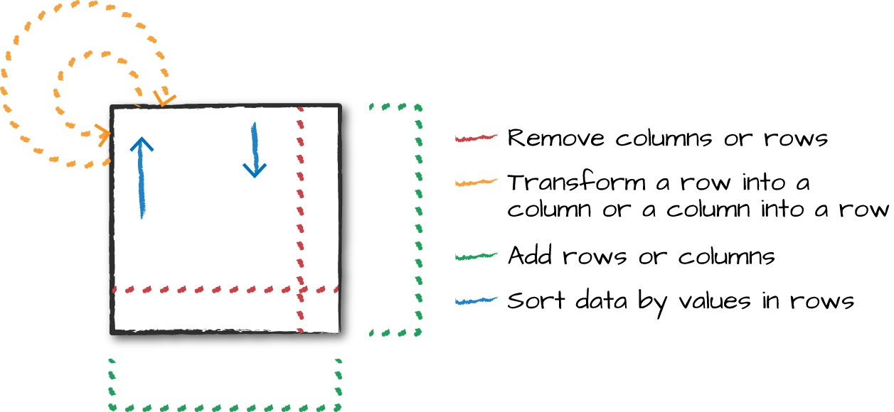

##  Basic Structured Operations

- Definitionally, a DataFrame consists of a series of records (like rows in a table), that are of type Row, and a number of columns 
  (like columns in a spreadsheet) that represent a computation expression that can be performed on each individual record in the Dataset.
- Schemas define the name as well as the type of data in each column.
- Partitioning of the DataFrame defines the layout of the DataFrame or Dataset’s physical distribution across the cluster.The partitioning scheme defines how    that is allocated.
- A schema is a StructType made up of a number of fields, StructFields, that have a name, type, a Boolean flag which specifies whether that column can contain   missing or null values, and, finally, users can optionally specify associated metadata with that column.

### Columns
- There are a lot of different ways to construct and refer to columns but the two simplest ways are by using the col or column functions.
- ```
    // in Scala to excess a column there are some shorthands like mentioned below.
    $"myColumn"
        or
    'myColumn
  ```

### Columns as expressions
- Columns provide a subset of expression functionality.
- If you use col() and want to perform transformations on that column, you must perform those on that column reference.
- When using an expression, the expr function can actually parse transformations and column references from a string and can subsequently be passed into         further transformations.
-  eg : expr("someCol - 5") is same as col("someCol") - 5 or even expr("someCol") - 5
- That’s because Spark compiles these to a logical tree specifying the order of operations.
- Columns are just expressions.
- Columns and transformations of those columns compile to the same logical plan as parsed expressions.


### Records and Rows
- Each row in a DataFrame is a single record.
- Spark represents this record as an object of type Row.
- Spark manipulates Row objects using column expressions in order to produce usable values.
- Row objects internally represent arrays of bytes.


### Creating Rows
- You can create rows by manually instantiating a Row object with the values that belong in each column.
- It’s important to note that only DataFrames have schemas. Rows themselves do not have schemas.

```
// in Scala
import org.apache.spark.sql.Row
val myRow = Row("Hello", null, 1, false)

# in Python
from pyspark.sql import Row
myRow = Row("Hello", None, 1, False)

```

- Accessing data in rows is equally as easy: you just specify the position that you would like.
- In Scala or Java, you must either use the helper methods or explicitly coerce the values.
- However, in Python or R, the value will automatically be coerced into the correct type.

```
// in Scala
myRow(0) // type Any
myRow(0).asInstanceOf[String] // String
myRow.getString(0) // String
myRow.getInt(2) // Int

# in Python
myRow[0]
myRow[2]

```

### DataFrame Transformations
- Some core operations which we do on dataframes are.
    1) We can add rows or columns.
    2) We can remove rows or columns
    3) We can transform a row into a column (or vice versa).
    4) We can change the order of rows based on the values in columns

    


```
// in Scala
val myDF = Seq(("Hello", 2, 1L)).toDF("col1", "col2", "col3")

# in Python
from pyspark.sql import Row
from pyspark.sql.types import StructField, StructType, StringType, LongType
myManualSchema = StructType([
StructField("some", StringType(), True),
StructField("col", StringType(), True),
StructField("names", LongType(), False)
])
myRow = Row("Hello", None, 1)
myDf = spark.createDataFrame([myRow], myManualSchema)
myDf.show()
```


### select and selectExpr
- select and selectExpr allow you to do the DataFrame equivalent of SQL queries on a table of data.
- you can refer to columns in a number of different ways.
    ```
    // in Scala
    import org.apache.spark.sql.functions.{expr, col, column}
    df.select(
    df.col("DEST_COUNTRY_NAME"),
    col("DEST_COUNTRY_NAME"),
    column("DEST_COUNTRY_NAME"),
    'DEST_COUNTRY_NAME,
    $"DEST_COUNTRY_NAME",
    expr("DEST_COUNTRY_NAME"))
    .show(2)
    
    # in Python
    from pyspark.sql.functions import expr, col, column
    df.select(
    expr("DEST_COUNTRY_NAME"),
    col("DEST_COUNTRY_NAME"),
    column("DEST_COUNTRY_NAME"))\
    .show(2)
    ```

- One common error is attempting to mix Column objects and strings. For example, the following code will result in a compiler error:
    ``` df.select(col("DEST_COUNTRY_NAME"), "DEST_COUNTRY_NAME") ```

- Here’s a simple example that adds a new column withinCountry to our DataFrame that specifies whether the destination and origin are the same:
    ``` 
        // in Scala
        df.selectExpr(
        "*", // include all original columns
        "(DEST_COUNTRY_NAME = ORIGIN_COUNTRY_NAME) as withinCountry")
        .show(2)
        # in Python
        df.selectExpr(
        "*", # all original columns
        "(DEST_COUNTRY_NAME = ORIGIN_COUNTRY_NAME) as withinCountry")\
        .show(2)
    ```


### Converting to Spark Types (Literals)
- we need to pass explicit values into Spark that are just a value (rather than a new column)
- The way we do this is through literals.
- This is basically a translation from a given programming language’s literal value to one that Spark understands.
- Literals are expressions and you can use them in the same way

```
// in scala
import org.apache.spark.sql.functions.lit
df.select(expr(*),lit(1).as("One")).show()

# in Python
from pyspark.sql.functions import lit
df.select(expr("*"), lit(1).alias("One")).show(2)

```

### Adding Columns
- There’s also a more formal way of adding a new column to a DataFrame, and that’s by using the withColumn method on our DataFrame.
- For example, let’s add a column that just adds the number one as a column:

    ```
    // in scala
    df.withColumn("numberOne",lit(1)).show()

    # in python
    df.withColumn("numberOne",lit(1)).show()

### Renaming Columns

```
// in Scala
df.withColumnRenamed("DEST_COUNTRY_NAME", "dest").columns

# in Python
df.withColumnRenamed("DEST_COUNTRY_NAME", "dest").columns
```

NOTE : By default Spark is case insensitive; however, you can make Spark case sensitive by setting the configuration:
        set spark.sql.caseSensitive true
    
### Removing Columns
- You likely already noticed that we can do this by using select. However, there is also a dedicated method called drop:
    ```  df.drop("ORIGIN_COUNTRY_NAME").columns ```

- We can drop multiple columns by passing in multiple columns as arguments:
    ``` dfWithLongColName.drop("ORIGIN_COUNTRY_NAME", "DEST_COUNTRY_NAME")  ```

### Changing a Column’s Type (cast)
- we might need to convert from one type to another.
- We can convert columns from one type to another by casting the column from one type to another.
- let’s convert our count column from an integer to a type Long:
    ```df.withColumn("count2", col("count").cast("long")) ```


### Filtering Rows
- To filter rows, we create an expression that evaluates to true or false.
- The most common way to do this with DataFrames is to create either an expression as a String or build an expression by using a set of column manipulations.
- There are two methods to perform this operation: you can use where or filter and they both will perform the same operation and accept the same argument        types when used with DataFrames.
```
    df.filter(col("count") < 2).show(2)
    df.where("count < 2").show(2)
```

- you might want to put multiple filters into the same expression. Although this is possible, it is not always useful, because Spark automatically performs      all filtering operations at the same time regardless of the filter ordering.

```
    // in Scala
    df.where(col("count") < 2).where(col("ORIGIN_COUNTRY_NAME") =!= "Croatia")
    .show(2)
    # in Python
    df.where(col("count") < 2).where(col("ORIGIN_COUNTRY_NAME") != "Croatia")\
    .show(2)
```


### Getting Unique Rows
- A very common use case is to extract the unique or distinct values in a DataFrame.
- These values can be in one or more columns.
- The way we do this is by using the distinct method on a DataFrame, which allows us to deduplicate any rows that are in that DataFrame.

```
    // in Scala
    df.select("ORIGIN_COUNTRY_NAME", "DEST_COUNTRY_NAME").distinct().count()
    # in Python
    df.select("ORIGIN_COUNTRY_NAME", "DEST_COUNTRY_NAME").distinct().count()
```

### Sorting Rows
- When we sort the values in a DataFrame, we always want to sort with either the largest or smallestvalues at the top of a DataFrame. 
- There are two equivalent operations to do this sort and orderBy that work the exact same way. 
- They accept both column expressions and strings as well as multiple columns. The default is to sort in ascending order:

```
    // in scala
    df.sort("count").show(5)
    df.orderBy("count").show()
    df.orderBy(col("count")).show()

    # in python
    df.sort("count").show()
    df.orderBy("count").show()
    df.orderBy(col("count")).show()
```

- To more explicitly specify sort direction, you need to use the asc and desc functions if operating on a column. 
- These allow you to specify the order in which a given column should be sorted:

```
    // in scala
    import org.apache.spark.sql.functions.{desc,asc}
    df.orderBy(expr("count desc")).show()
    df.orderBy(desc("count")).show()

    # in python
    from pyspark.sql.functions import desc,asc
    df.orderBy(expr("count desc")).show()
    df.orderBy(desc("count")).show()

```

## NOTE :
    - An advanced tip is to use asc_nulls_first, desc_nulls_first, asc_nulls_last, or desc_nulls_last to specify where you would like your null values to        appear in an ordered DataFrame.
    - For optimization purposes, it’s sometimes advisable to sort within each partition before another set of transformations.
    - You can use the sortWithinPartitions method to do this:
    
    ```
        // in Scala
        spark.read.format("json").load("/data/flight-data/json/*-summary.json")
        .sortWithinPartitions("count")
        
        # in Python
        spark.read.format("json").load("/data/flight-data/json/*-summary.json")\
        .sortWithinPartitions("count")
    ```


### Limit
- you might want to restrict what you extract from a DataFrame
- you might want just the top ten of some DataFrame.You can do this by using the limit method:

```
    // in Scala
    df.limit(5).show()

    # in Python
    df.limit(5).show()

    -- in SQL
    select *from dfTable limit 5

    // in scala
    df.orderBy(expr("count desc")).limit(6).show()

    # in Python
    df.orderBy(expr("count desc")).limit(6).show()

    -- in SQL
    select *from dfTable order by count desc limit 6;

```


### Repartition and Coalesce
- Another important optimization opportunity is to partition the data according to some frequently filtered columns, which control the physical layout of data   across the cluster including the partitioning scheme and the number of partitions.
- Repartition will incur a full shuffle of the data, regardless of whether one is necessary.
- This means that you should typically only repartition when the future number of partitions is greater than your current number of partitions or when you are   looking to partition by a set of columns

```
    // in Scala
    df.rdd.getNumPartitions // 1

    # in Python
    df.rdd.getNumPartitions() // 1

    // in scala
    df.repartition(5)

    # in Python
    df.repartition(5)
```

- If you know that you’re going to be filtering by a certain column often, it can be worth repartitioning based on that column:

```
// in Scala
df.repartition(col("DEST_COUNTRY_NAME"))

# in Python
df.repartition(col("DEST_COUNTRY_NAME"))

```

- You can optionally specify the number of partitions you would like, too:
    
    ```
    // in Scala
    df.repartition(5, col("DEST_COUNTRY_NAME"))
    # in Python
    df.repartition(5, col("DEST_COUNTRY_NAME"))
    
    ```

- Coalesce, on the other hand, will not incur a full shuffle and will try to combine partitions.
- This operation will shuffle your data into five partitions based on the destination country name, and then coalesce them (without a full shuffle)

    ```
    // in Scala
    df.repartition(5,col("DEST_COUNTRY_NAME")).coalesce(2)
    
    # in Python
    df.repartition(5,col("DEST_COUNTRY_NAME")).coalesce(2)
    ```


### Collecting Rows to the Driver
- Spark maintains the state of the cluster in the driver.
- There are times when you’ll want to collect some of your data to the driver in order to manipulate it on your local machine.
- collect gets all data from the entire DataFrame, take selects the first N rows, and show prints out a number of rows nicely.

```
    // in Scala
    val collectDF = df.limit(10)
    collectDF.take(5) // take works with an Integer count
    collectDF.show() // this prints it out nicely
    collectDF.show(5, false)
    collectDF.collect()

    # in Python
    collectDF = df.limit(10)
    collectDF.take(5) # take works with an Integer count
    collectDF.show() # this prints it out nicely
    collectDF.show(5, False)
    collectDF.collect()
```

- There’s an additional way of collecting rows to the driver in order to iterate over the entire dataset.
- The method toLocalIterator collects partitions to the driver as an iterator.
- This method allows you to iterate over the entire dataset partition-by-partition in a serial manner.

``` collectDF.toLocalIterator() ```


