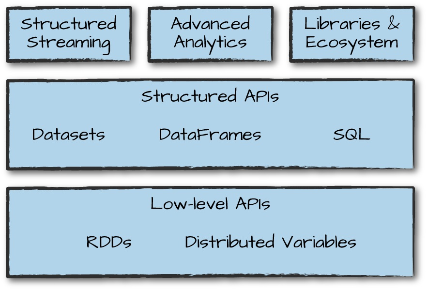

## A Tour of Spark’s Toolset

&nbsp;
&nbsp;

- These simple conceptual building blocks are the foundation of Apache Spark’s vast ecosystem of tools and libraries.
- Spark is composed of these primitives the lower-level APIs and the Structured APIs and then a series of standard libraries for additional functionality.