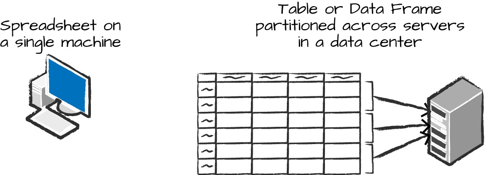

# Introduction to Spark.

### Context: The Big Data Problem
- Why do we need a new engine and programming model for data analytics in the first place?
- For most of their history, computers became faster every year through processor speed increases.
- The new processors each year could run more instructions per second than the previous year’s.
- As a result, applications also automatically became faster every year, without any changes needed to their code.
- This trend led to a large and established ecosystem of applications building up over time, most of which were designed to run only on a single processor.
- These applications rode the trend of improved processor speeds to scale up to larger computations and larger volumes of data over time.
- Unfortunately, this trend in hardware stopped around 2005: due to hard limits in heat dissipation,hardware developers stopped making individual processors faster, and switched toward adding more parallel CPU cores all running at the same speed.
- The cost to store 1 TB of data continues to drop by roughly two
times every 14 months, meaning that it is very inexpensive for organizations of all sizes to store large amounts of data.
- Moreover, many of the technologies for collecting data (sensors, cameras, public datasets, etc.) continue to drop in cost and improve in resolution.
- For example, camera technology continues to improve in resolution and drop in cost per pixel every year, to the point where a 12-megapixel webcam costs only $3 to $4; this has made it inexpensive to collect a wide range of visual data, whether from people filming video or automated sensors in an industrial setting.
- The end result is a world in which collecting data is extremely inexpensive—many organizations today even consider it negligent not to log data of possible relevance to the business—but processing it requires large, parallel computations, often on clusters of machines.
- Moreover, in this new world, the software developed in the past 50 years cannot automatically scale up, and neither can the traditional programming models for data processing applications, creating the need for new programming models.
- It is this world that Apache Spark was built for.
- cluster computing held tremendous potential: at every organization that used MapReduce, brand new applications could be built using theexisting data, and many new groups began using the system after its initial use cases.
- However, the MapReduce engine made it both challenging and inefficient to build large applications.
- To address this problem, the Spark team first designed an API based on functional programming that could succinctly express multistep applications.
- The team then implemented this API over a new engine that could perform efficient, in-memory data sharing across computation steps.
- Spark’s core idea of composable APIs has also been refined over time.
- Early versions of Spark (before 1.0) largely defined this API in terms of functional operations—parallel operations such as maps and reduces over collections of Java objects.
- Beginning with 1.0, the project added Spark SQL, a new API for working with structured data—tables with a fixed data format that is not
tied to Java’s in-memory representation.
- Spark SQL enabled powerful new optimizations across
libraries and APIs by understanding both the data format and the user code that runs on it in more detail.
___

## A Gentle Introduction to Spark

### Spark’s Basic Architecture
- A cluster, or group, of computers, pools the resources of many machines together, giving us the ability to use all the cumulative resources as if they were a single computer.
- Now, a group of machines alone is not powerful, you need a framework to coordinate work across them.
- Spark does just that, managing and coordinating the execution of tasks on data across a cluster of computers.
- The cluster of machines that Spark will use to execute tasks is managed by a cluster manager like Spark’s standalone cluster manager, YARN, or Mesos.
- We then submit Spark Applications to these cluster managers, which will grant resources to our application so that we can complete our work.
___

### Spark Applications
- Spark Applications consist of a driver process and a set of executor processes.
- The driver process runs your main() function, sits on a node in the cluster, and is responsible for three things:
    - maintaining information about the Spark Application
    - responding to a user’s program or input
    - analyzing, distributing, and scheduling work across the executors
- The driver process is absolutely essential—it’s the heart of a Spark Application and maintains all relevant information during the lifetime of the application.
- The executors are responsible for actually carrying out the work that the driver assigns them.
- This means that each executor is responsible for only two things:
    - executing code assigned to it by the driver
    - reporting the state of the computation on that executor back to      the driver node

    

- In the above figure we can see the driver on the left and four           executors on the right.
- In this diagram, we removed the concept of cluster nodes.
- The user can specify how many executors should fall on each
  node through configurations.

___
## NOTE
1) Spark, in addition to its cluster mode, also has a local mode.
2) The driver and executors are simply processes, which means
   that they can live on the same machine or different machines.
3) In local mode, the driver and executurs run (as threads) on
   your individual computer instead of a cluster.

### Here are the key points to understand about Spark Applications at this point:
1) Spark employs a cluster manager that keeps track of the resources        available.
2) The driver process is responsible for executing the driver program’s     commands across the executors to complete a given task.
3) The executors, for the most part, will always be running Spark code.
4) The driver can be “driven” from a number of different languages          through Spark’s language APIs.
___

## Spark’s Language APIs
- Spark’s language APIs make it possible for you to run Spark code using   various programming languages.
- Spark presents some core “concepts” in every language; these concepts
  are then translated into Spark code that runs on the cluster of machines.
- Scala
    - Spark is primarily written in Scala, making it Spark’s “default” language.
- Java
    - Even though Spark is written in Scala, Spark’s authors have been     careful to ensure that you can write Spark code in Java.
- Python
    - Python supports nearly all constructs that Scala supports.
- SQL
    - Spark supports a subset of the ANSI SQL 2003 standard. This makes    it easy for analysts and non-programmers to take advantage of the    big data powers of Spark.
- R
    - Spark has two commonly used R libraries: one as a part of            Sparkcore (SparkR) and another as an R community-driven package      (sparklyr).

    

- There is a
SparkSession object available to the user, which is the entrance point to running Spark code.
- When using Spark from Python or R, you don’t write explicit JVM instructions; instead, you write Python and R code that Spark translates into code that it then can run on the executor JVMs.
___

#### Spark has two fundamental sets of APIs:
1) The low-level “unstructured” APIs.
2) The higher-level structured APIs.


### The SparkSession
- You control your Spark Application through a driver
  process called the SparkSession.
- The SparkSession instance is the way Spark executes user-defined
  manipulations across the cluster.
- There is a one-to-one correspondence between a SparkSession and
  a Spark Application.
- Let’s go ahead and look at the SparkSession in both Scala and/or Python:
    - scala

        ```res0: org.apache.spark.sql.SparkSession = org.apache.spark.sql.SparkSession@...```
    - python

        ```pyspark.sql.session.SparkSession``` 

### DataFrames
- A DataFrame is the most common Structured API and simply represents a table of data with rows and
  columns.
- The list that defines the columns and the types within those columns is called the schema.
- The reason for putting the data on more than one computer should be intuitive:
    - either the data is too large to fit on one machine or 
    - it would simply take too long to perform that computation on one machine.

        
- The DataFrame concept is not unique to Spark. R and Python both have similar concepts.
- However, Python/R DataFrames (with some exceptions) exist on one machine rather than multiple       machines.

### NOTE
- Spark has several core abstractions:
    - Datasets, DataFrames, SQL Tables, and Resilient Distributed Datasets (RDDs).
    - These different abstractions all represent distributed collections of data.
    - The easiest and most efficient are DataFrames, which are available in all languages.
___

### Partitions
- To allow every executor to perform work in parallel, Spark breaks up the data into chunks called
  partitions.
- A partition is a collection of rows that sit on one physical machine in your cluster.
- A DataFrame’s partitions represent how the data is physically distributed across the cluster of     machines during execution.
- If you have one partition, Spark will have a parallelism of only one, even if you
  have thousands of executors.
- If you have many partitions but only one executor, Spark will still have a parallelism of only      one because there is only one computation resource.
- An important thing to note is that with DataFrames you do not (for the most part) manipulate        partitions manually or individually.
- You simply specify high-level transformations of data in the physical partitions, and Spark         determines how this work will actually execute on the cluster.

### Transformations
- In Spark, the core data structures are immutable, meaning they cannot be changed after              they’recreated.
- Transformations are the core of how you express your business logic using Spark.
- There are two types of transformations.
    - those that specify narrow dependencies
    - those that specify wide dependencies.
- Transformations consisting of narrow dependencies (we’ll call them narrow transformations) are
  those for which each input partition will contribute to only one output partition.
- The where statement specifies a narrow dependency, where only one partition contributes to at most one output partition.
    
    

- A wide dependency (or wide transformation) style transformation will have input partitions
  contributing to many output partitions.
- You will often hear this referred to as a shuffle whereby Spark will exchange partitions across     the cluster.
- With narrow transformations, Spark will automatically perform an operation called pipelining,       meaning that if we specify multiple filters on DataFrames, they’ll all be performed in-memory.
- The same cannot be said for shuffles. When we perform a shuffle, Spark writes the results to disk.
    
    

 - Transformations are simply ways of specifying different series of data manipulation. This
   leads us to a topic called lazy evaluation.

___

### Lazy Evaluation
